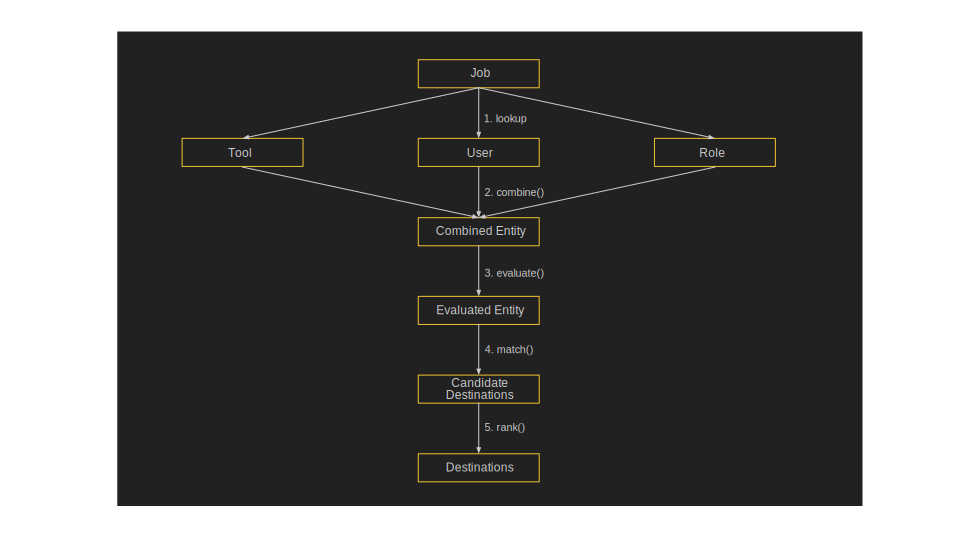

#########################
Concepts and Organisation
#########################

Object types
============

Conceptually, TPV consists of the following types of objects.

1. Entities - An entity is anything that will be considered for scheduling
by TPV. Entities include Tools, Users, Groups, Rules and Destinations.
All entities have some common properties (id, cores, mem, env, params,
scheduling tags).

2. Scheduling Tags - Entities can have scheduling tags defined on them that determine which
entities match up, and which destination they can schedule on. Tags fall into one of four categories,
(required, preferred, accepted, rejected), ranging from indicating a requirement for a particular entity,
to indicating complete aversion.

3. Loader - The loader is responsible for loading entity definitions from a config file.
The loader will parse and validate entity definitions, including compiling python expressions,
and processing inheritance, to produce a list of entities suitable for mapping. The loader is also
capable of loading config files from multiple sources, including https urls.

4. Mapper - The mapper is responsible for routing a Galaxy job to its destination, based on the current user,
tool and job that must be scheduled. The mapper will respect the scheduling constraints expressed by the
loaded entities.

Operations
==========

When a mapper routes jobs to a destination, it does so by applying 5 basic operations on entities.

1. Inherit
----------
The inherit operation enables an entity to inherit the properties of another entity of the same
type, and to override any required properties. While a Tool can inherit another tool, which can in-turn inherit
yet another tool, it cannot inherit a User, as it's a different entity type. It is also possibly to globally define
a `default_inherits` field, which is the entity that all entity name that all entities will inherit from should they
not have an `inherits` tag explicitly defined. Inheritance is generally processed at load time by the `Loader`,
so that there's no cost at runtime. However, the `Mapper` will process default inheritance, should the user, role
or tool that is being dispatched does not have an entry in the entities list.

When inheriting scheduling tags, if the same tag is defined by both the parent and the child, only the child's
tag will take effect. For example, if a parent defines `high-mem` as a required tag, but a child defines `high-mem`
as a preferred tag, then the tag will be treated as a preferred tag.

2. Combine
----------
The combine operation matches up the current user, role and tool entities, and creates a combined
entity that shares all their respective preferences. The combine operation follows specific rules:

Combining gpus, cores and mem
In this case, the lower of the two values are used. For example, if a user entity specific 8 cores, and a tool
requires 2 cores, then the lower value of 2 is used. An example of how this property can be used is to restrict
training users from running jobs with lower memory than the defaults when running assembly jobs.

Combining tags
^^^^^^^^^^^^^^
When combining tags, if a role expresses a preferences for tag `training` for example, and a tool expresses a
requirement for tag `high-mem`, the combined entity would share both preferences. This can be used to route certain
roles or users to specific destinations for example.

However, if the tags are mutually exclusive, then an IncompatibleTagsException is raised. For example, if a role
expressed a preference for training, but the tool rejected tag `training`, then the job can no longer be scheduled.
If the tags are compatible, then the tag with the stronger claim takes effect. For example, if a tool requires
'high-mem` and a user prefers `high-mem`, then the combined entity will require `high-mem`. An example of using
this property would be to restrict the availability of dangerous tools only to trusted users.

Combining envs and params
^^^^^^^^^^^^^^^^^^^^^^^^^
In this case, these requirements are simply merged, with duplicate envs and params merged in the following order:
User > Role > Tool.

3. Evaluate
-----------
This operation evaluates any python expressions in the TPV config. It is divided into two steps, evaluate_early()
and evaluate_late(). The former runs before the combine step and evaluates expressions for cores, mem and gpus.
This ensures that at the time of combining entities, these values are concrete and can be compared. After the combine()
step, the evaluate_late() function evaluates all remaining variables, ensuring that they have the latest possible
values after combining requirements.

4. Match
--------
The match operation is used to find matching destinations for the combined, evaluated entity. This step ensures
that the destination has sufficient gpus, cores and mem to satisfy the entity's request, assuming these are defined.
If these are not defined, a match is assumed. In addition, all destinations that do not have tags required by the
entity are rejected, and all destinations that have tags rejected by the entity are also rejected. Preference and
acceptance is not considered at this stage, simply compatibility with available destinations based on the tag
compatibility table documented later.

5. Rank
--------
After the matching destinations are short listed, they are ranked using a pluggable rank function. The default
rank function simply sorts the destinations by tags that have the most number of preferred tags, with a penalty
if preferred tags are absent. However, this default rank function can be overridden per entity, allowing a custom
rank function to be defined in python code, with arbitrary logic for picking the best match from the available
candidate destinations.

Job Dispatch Process
====================

When a typical job is dispatched, TPV follows the process below.

1. lookup - Looks up Tool, User and Role entity definitions that match the job
2. evaluate_early() - Evaluates gpu, cores, and mem expressions
3. combine() - Combines entity requirements to create a merged entity. Uses lower of gpu, cores and mem requirements
4. evaluate_late() - Evaluates remaining expressions as late as possible
5. match() - Matches the combined entity requirements with a suitable destination
6. rank() - The matching destinations are ranked
7. choose - The ranked destinations are evaluated, with the first non-failing match chosen (no rule failures)

Expressions
===========

Most TPV properties can be expressed as python expressions. The rule of thumb is that all string expressions
are evaluated as python f-strings, and all integers or boolean expressions are evaluated as python code blocks.
For example, cpu, cores and mem are evaluated as python code blocks, as they evaluate to integer/float values.
However, env and params are evaluated as f-strings, as they result in string values. This is to improve the readability
and syntactic simplicity of TPV config files.

At the point of evaluating these functions, there is an evaluation context, which is a default set of variables
that are available to that expression. The following default variables are available to all expressions:

Default evaluation context
--------------------------
+----------+-----------------------------------------------------------------------------+
| Variable | Description                                                                 |
+==========+=============================================================================+
| app      | the Galaxy App object                                                       |
+----------+-----------------------------------------------------------------------------+
| tool     | the Galaxy tool object                                                      |
+----------+-----------------------------------------------------------------------------+
| user     | the current Galaxy user object                                              |
+----------+-----------------------------------------------------------------------------+
| job      | the Galaxy job object                                                       |
+----------+-----------------------------------------------------------------------------+
| mapper   | the TPV mapper object, which can be used to access parsed TPV configs |
+----------+-----------------------------------------------------------------------------+
| entity   | the TPV entity being currently evaluated. Can be a combined entity.      |
+----------+-----------------------------------------------------------------------------+
| self     | an alias for the current TPV entity.                                     |
+----------+-----------------------------------------------------------------------------+

Custom evaluation contexts
---------------------------
These are user defined context values that can be defined globally, or locally at the level of each
entity. Any defined context value is available as a regular variable at the time the entity is evaluated.

Special evaluation contexts
---------------------------
In addition to the defaults above, additional context variables are available at different steps.

*gpu, core and mem expressions* - these are evaluated in order, and thus can be referred to in that same order.
For example, gpu expressions cannot refer to core and mem, as they have not been evaluated yet. cpu
expressions can be based on gpu values. mem expressions can refer to both cores and gpus.

*env and param expressions* - env expressions can be based on gpu, cores or mem. param expressions can additional
refer to evaluated env expressions.

*rank functions* - these can refer to all prior expressions, and are additional passed in a `candidate_destinations`
array, which is a list of matching TPV destinations.

Scheduling
==========

TPV offers several mechanisms for controlling scheduling, all of which are optional.
In its simplest form, no scheduling constraints would be defined at all, in which case
the entity would schedule on the first available entity. Admins can use additional

+-----------+--------------------------------------------------------------------------------------------------------+
| Tag Type  | Description                                                                                            |
+===========+========================================================================================================+
| require   | required tags must match up for scheduling to occur. For example, if a tool is marked as requiring the |
|           | `high-mem` tag, only destinations that are tagged as requiring, preferring or accepting the            |
|           | `high-mem` tag would be considering for scheduling.                                                    |
+-----------+--------------------------------------------------------------------------------------------------------+
| prefer    | prefer tags are ranked higher that accept tags when scheduling decisions are made.                     |
+-----------+--------------------------------------------------------------------------------------------------------+
| accept    | accept tags can be used to indicate that a entity can match up or support another entity, even         |
|           | if not preferentially.                                                                                 |
+-----------+--------------------------------------------------------------------------------------------------------+
| reject    | reject tags cannot be present for scheduling to occur. For example, if a tool is marked as rejecting   |
|           | the `pulsar` tag, only destinations that do not have that tag are considered for scheduling. If two    |
|           | entities have the same reject tag, they still repel each other.                                        |
+-----------+--------------------------------------------------------------------------------------------------------+

Tag compatibility table
-----------------------

+------------+---------+--------+--------+--------+------------+
| Tag Type   | Require | Prefer | Accept | Reject | Not Tagged |
+============+=========+========+========+========+============+
| Require    |    ✓    |    ✓   |    ✓   |   ✕    |     ✕      |
+------------+---------+--------+--------+--------+------------+
| Prefer     |    ✓    |    ✓   |    ✓   |   ✕    |     ✓      |
+------------+---------+--------+--------+--------+------------+
| Accept     |    ✓    |    ✓   |    ✓   |   ✕    |     ✓      |
+------------+---------+--------+--------+--------+------------+
| Reject     |    ✕    |    ✕   |    ✕   |   ✕    |     ✓      |
+------------+---------+--------+--------+--------+------------+
| Not Tagged |    ✕    |    ✓   |    ✓   |   ✓    |     ✓      |
+------------+---------+--------+--------+--------+------------+

Scheduling by tag match
------------------------
Tags can be used to model anything from compatibility with a destination, to
permissions to execute a tool. (e.g. a tool can be tagged as requiring the "restricted"
tag, and users can be tagged as rejecting the "restricted" tag by default. Then, only users
who are specifically marked as requiring, tolerating, or preferring the "restricted" tag
can execute that tool. Of course, the destination must also be marked as not rejecting the
"restricted" tag.

Scheduling by rules
-------------------
Rules can be used to conditionally modify any entity requirement. Rules can be given an ID,
which can subsequently be used by an inheriting entity to override the rule. If no ID is
specified, a unique ID is generated, and the rule can no longer be overridden. Rules
are typically evaluated through an `if` clause, which specifies the logical condition under
which the rule matches. If the rule matches, cores, memory, scheduling tags etc. can be
specified to override inherited values. The special clause `fail` can be used to immediately
fail the job with an error message. The `execute` clause can be used to execute an arbitrary
code block on rule match.

Scheduling by custom ranking functions
--------------------------------------
The default rank function sorts destinations by scoring how well the tags match the job's requirements.
As this may often be too simplistic, the rank function can be overridden by specifying a custom
rank clause. The rank clause can contain an arbitrary code block, which can do the desired sorting,
for example by determining destination load by querying the job manager, influx statistics etc.
The final statement in the rank clause must be the list of sorted destinations.
